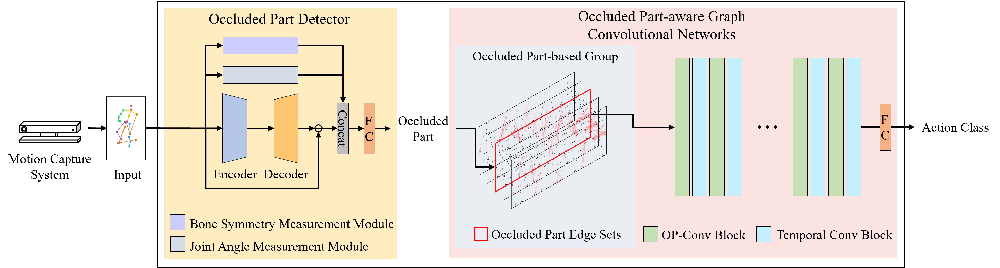

# Occluded Part-aware Graph Convolutional Networks for Skeleton-based Action Recognition (OP-GCN)
Min Ju Kim†, Min Hyuk Kim†, Seok Bong Yoo∗

Recognizing human action is one of the most important factors in the visual perception of robots. Specifically, skeleton- based action recognition has been actively researched to enhance recognition performance at a lower cost. However, action recognition in occlusion situations, where parts of the body are not visible, is still a challenge. To address this challenge, we propose an occluded part-aware graph convolutional network (OP-GCN), using the optimal occluded body parts. The proposed model identifies occluded body parts within a human skeleton using an occluded part detector. It is based on an auto-encoder trained on a non-occluded human skeleton and exploits the symmetry and angular information of the human skeleton. Then, we select an optimal group constructed with consideration for the occluded body parts. Each group comprises five sets of joint nodes, focusing on the body parts excluding the occluded body parts. Finally, to enhance interaction within the selected groups, we apply the inter-part association module, which considers a fusion of global and local elements. The experimental results show that the proposed model outperforms other models when compared on occluded datasets. These comparative experiments demonstrate the effectiveness of our study in addressing the challenge of action recognition in occlusion situations

